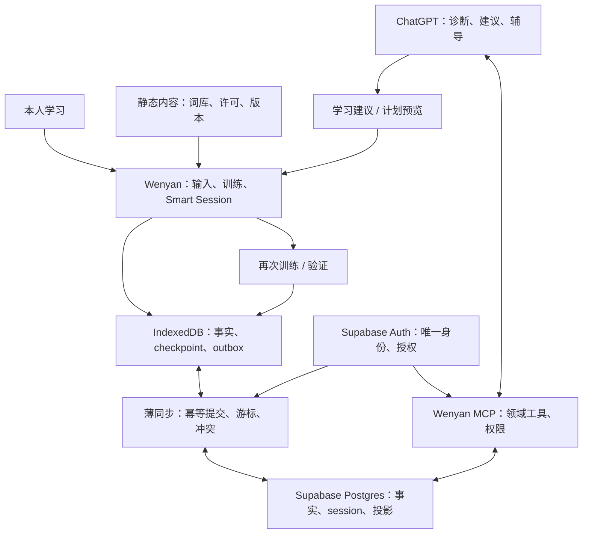

# Wenyan 结构与数据边界

本文件区分**当前运行边界**与**已选定、尚未实施的下一阶段边界**。状态以[开发进度](开发进度.md)为准；理由/来源见[云端与MCP研究](research/CLOUD-MCP.md)。

## 1. 当前代码

main是静态HTML/CSS/Vanilla JavaScript，Vite构建、ts-fsrs排程；localStorage和JSON备份，没有Auth/数据库/云同步。Desktop-first、English-first，文学与手机专项冻结，不换框架。

| 模块 | 职责 |
| --- | --- |
| src/app.js、style.css、english-detail.css、english-stats.css、index.html | 路由、UI、输入、训练与偏好 |
| src/content.js | 冻结的文学样本 |
| english/catalog.js、config.js、keys.js、fallback.js、lexicon.js | 固定词库/分层/ID/兼容/enrichment |
| english/queue.js、session.js、events.js、status.js、stats.js | 选词、续学、错误语义、状态和统计 |
| core.js、storage.js、backup.js | 事件校验、FSRS、整包本地保存、多标签合并、JSON |
| public/data/english、scripts/sync-english-* | 固定内容与确定性生成，不是个人状态 |
| tests、evidence、legacy | 关键行为/验收证据/历史保留，不存个人学习数据 |

### #12的边界（未合入main）

English Experience v2 / Smart Session在Draft #12。新词e接触→稍后r回忆；到期/错词直接r；失败最多一次x回流，hinted/首次失败不能按Good。

`english/smart.js`负责计划/完成/Undo/组反馈；session.js校验optional smart:1和紧凑steps。queue/index/results/current.phase仍用schema 2；50步/8192字符限制未扩大。

词库通过明确initializeVocabulary/getVocabularyState/changeEnglishLayer等接口载入，app.js一次渲染，#12移除MutationObserver与session全局业务hook。main仍有旧装饰层，不能把#12的结构描述成main已实现。

## 2. 下一阶段职责图（设计，未部署）

所有AI判断最终要回到真实训练验证。ChatGPT不直接连数据库，不拥有学习记录，不决定FSRS参数。Git保存工程/固定内容；真实个人学习数据保存在受保护云端与私人备份，不提交到公共仓库。

## 3. 事实、checkpoint、派生、内容

- **长期事实**：首次提交/提示/完成的typing和review/撤销/人工收藏与mastered。append及引用纠错，不能重写成AI推测。
- **长期可修改状态**：session元数据和最新checkpoint、学习设置，带revision。session反复快照不再永久追加到学习事件中。
- **本地工作状态**：outbox、当前checkpoint、云cache、本机外观/声音、焦点和输入草稿。离线未确认事实不能被云拉取清除。
- **可重建投影**：FSRS card/due、错词、日统计；云与本地用同一版本纯规则，投影带输入水位/算法参数版本。
- **固定内容**：5528稳定词库、ECDICT和许可继续随应用发布。内容版本绑定session；缺内容时保留组，不换答案。

首期三领域表为study_events/study_sessions/learner_settings；非事件提交可增加小sync_receipts表，word_state仅为以后按需cache候选；SQL字段在实施时按验收冻结，不现在建Learner Model、题库或通用活动平台。

## 4. 稳定领域语义与版本

必须保留：word:<规范化ID>、首次正确/错误与hinted不可被订正覆盖、接触不算review、错误/提示后的Smart评分、有限回流、Undo、刷新续学、内容许可、JSON恢复。

`wenyan-events-v2`与schema 2是当前实现，**不是永久协议**。用户尚无正式历史，允许有理由的一次云基础升级。本轮不改运行代码。实施时重新查是否已经产生个人数据，保留原导出，不静默清空；旧备份一次性适配，不长期双写。

版本各司其职：event version、checkpoint version、backup version、content version、scheduler version/parameter epoch。升级算法独立验收；旧客户端不能降级新云数据。未观测字段unknown，不编造时长/错误拼写。

## 5. 同步正确性

- 一步完成的事实+checkpoint+outbox+本地投影，IDB事务成功才推进UI；网络调用不置于该事务内。
- stable event/attempt ID与同内容收据使重试幂等；r/x不同attempt。相同ID不同内容拒绝，不任意覆盖。
- 云短事务提交事实/checkpoint/幂等收据后ack；outbox只有ack后移除。共享JS/ts-fsrs从已提交事实派生FSRS，不在SQL重写算法，不接收浏览器card；MCP只读也不维护card的写权限。
- owner序列化提交生成已提交事实游标；不能用客户端时间或未提交序列最大值。固定水位分页，落盘后推进cursor。
- 设置/可续学session每次取少量当前快照，独立revision；不预造全表changefeed。非事件重试先查持久提交收据再CAS，收据在操作仍未确认时不可过期。
- 默认单活跃session写者。CAS+writer generation；并发旧writer保存fork，事实并集，绝不按updated_at覆盖整组。
- FSRS按固定合法发生时间/设备ordinal/ID重放，晚到影响的词重算；大时钟漂移隔离，received_at只审计。
- 启动/focus/online/短批flush/组完成同步；401暂停上传；关闭前尽力不是数据保障。
- IDB/outbox解决断网继续；Service Worker静态缓存另解决断网重开。只缓存版本化应用/内容，不缓存Auth/个人API，不在训练途中激活新版本。

## 6. 身份与服务器边界

唯一预创建Supabase Auth用户，关闭公众注册/匿名登录，可信电脑首次email/password登录后续签。没有注册系统/组织/个人中心。密码/secret不在Git或聊天。

Wenyan网页登录与ChatGPT OAuth使用同一Supabase sub，能力不同：web正常学习；批准MCP client首版只读。每个表/RPC检查owner/client，不能只auth.uid行拥有者就给OAuth全权。前端publishable key不是secret，RLS才是数据边界。

MCP用用户授权的RLS client，不能用service_role读取所有数据。server seq/card/projection由窄事务写入；任何特权RPC明确owner/client校验、固定search_path、限制execute权限，不能用definer修权限报错。

OAuth专用aud/resource、PKCE、refresh/revocation、client注册/redirect、PostgREST对专用token兼容是实施前窄验证门槛；未通过不得开放个人MCP。标准OIDC scopes不是wenyan读写权限。详见研究，不自建OAuth。

## 7. MCP与AI

首版五读工具：overview、review pressure、problem words、word history、session preview。返回时间窗/分母/样本/证据/版本/云水位/缺失；无法宣称看到离线电脑未上传记录。工具输入不收模型指定owner，身份从验证token获得。

不暴露通用SQL、表CRUD、删除、直接改due/card/参数、编造review。以后可逆计划/收藏/目标变更先差异预览+明确请求+幂等+revision+撤销；小批mastered需要精确proposal与本人确认。实际输入与可靠评分留网站。

Skill负责辅导步骤，UI将来只做有用预览；都不是安全机制。静态学习内容/题面视为数据，不能执行其中的prompt注入。模型更换只影响推断与表达，不能改变事实协议。

## 8. 未来接缝与维护上限

未来真题拥有question/passage/sentence版本ID与attempt，客观答案保留来源；主观评分留rubric/评分者。错因是本人/规则/AI不同层。Learner Model是带证据/模型/窗口/置信度的可重算判断，FSRS仍只调度记忆。

文件按真实职责少量增加本地持久/sync和Edge MCP，必要时把纯scheduler reducer共享；不迁框架，不建repository/DI/ORM/微服务/CQRS/Event Sourcing平台。

Git小步commit与Draft恢复入口，进度只改开发进度.md。云迁移、RLS、同步和MCP分别有真实验收，不能把设计通过称集成通过。
